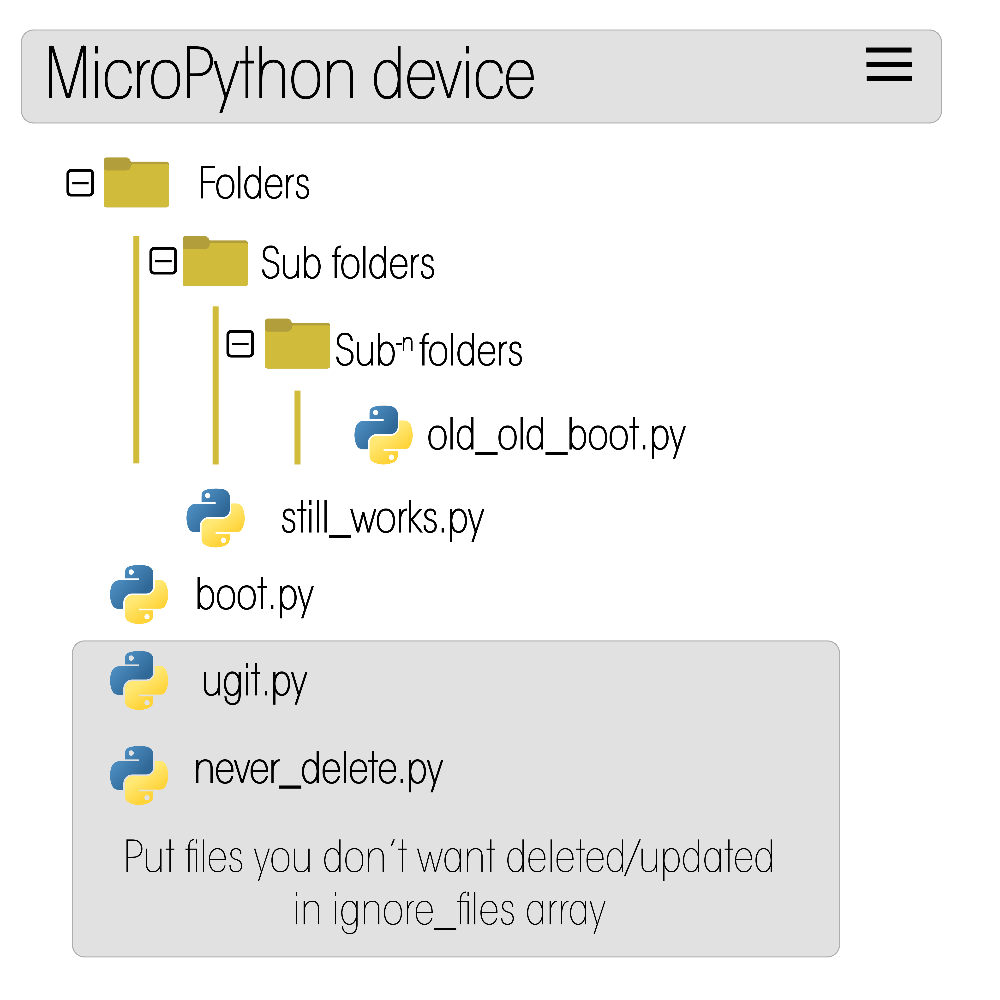

<br />
<div align="center">
    
    <h1 align="center">Micropython OTA Updates</h1>
  <h3 align="center">Keep your remote ESP32 devices in sync with a github repo.</h3>
  <h2 align="center">Pulls entire github repository onto a micropython board</h2>
  <p align="center"> Over The Air, with one command: ugit.pull_all()</p>
</div>


## About ugit

This is meant to clone an entire micropython repository to an internet enable micropython microcontroller. You can use it to periodically update the entire ESP32 micropython file structure to match an open github repository.

If there are files that you want to be left intact on the ESP32 regardless of the changes done to the github repository. Just add the file name in ignore_files array. Located on line 27 of ugit.py.

ugit functions:
* ugit will update the internal file structure of an ESP32 with a github repository
* Files Folders and file Deletions are updated to the board
* Specify which repository, ingore files, and user inside of ugit.py



With ugit you can update a micropython board with a complete micropython library from github.

Download `ugit.py` to your ESP32 micropython board to get started.

<p align="right">(<a href="#readme-top">back to top</a>)</p>


<!-- GETTING STARTED -->

# make sure to back up your code before trying ugit
## when you run ugit.pull_all() it will download all the files in the repository and delete any files on the board that are not in the variable ignore_files array.

## Getting Started

```python
#boot.py

import ugit

ugit.backup() # good idea to backup your files!

ugit.pull_all()
```
### Installation

Simply put: copy ugit.py onto the micropython board.

1. Copy ugit.py onto your micropython board
2. modify ugit_config with the user,repository,ssid, and password
4. run the ugit.pull_all()


<!-- USAGE EXAMPLES -->
## Usage

You can use ugit without any other code in boot. It will connect to wifi and download filetree from github and copy the raw data to your board.

```python
# boot.py

import ugit

ugit.pull_all()
```

### If you want to use your own method of connecting to wifi you can add the isconnected=true parameter to ugit.pull_all()

```python
#boot.py
    
import ugit
import network

wlan = network.WLAN(network.STA_IF)
wlan.active(True)
wlan.connect('SSID','Password')

ugit.pull_all(isconnected=True)
```

### You can also use the built in function wificonnect()
```python
import ugit

wlan = ugit.wificonnect('SSID','PASSWORD')

# backup internal files
ugit.backup() # saves to ugit.backup file

# Pull single file
ugit.pull('file_name.ext','Raw_github_url')

# Pull all files
ugit.pull_all()
```

## Roadmap

See the [open issues](https://github.com/turfptax/ugit/issues) for a list of proposed features (and known issues).

As we test and update the code to work in a variety of scenarious we wish to have the following features implemented as soon as possible.

- Rollback function
- SHA1 internal hash storage - Currently ugit pulls all files
- ugit.py update function - updates the ugit.py code from this repository (currently in dev branch)
- Simplified Logging


