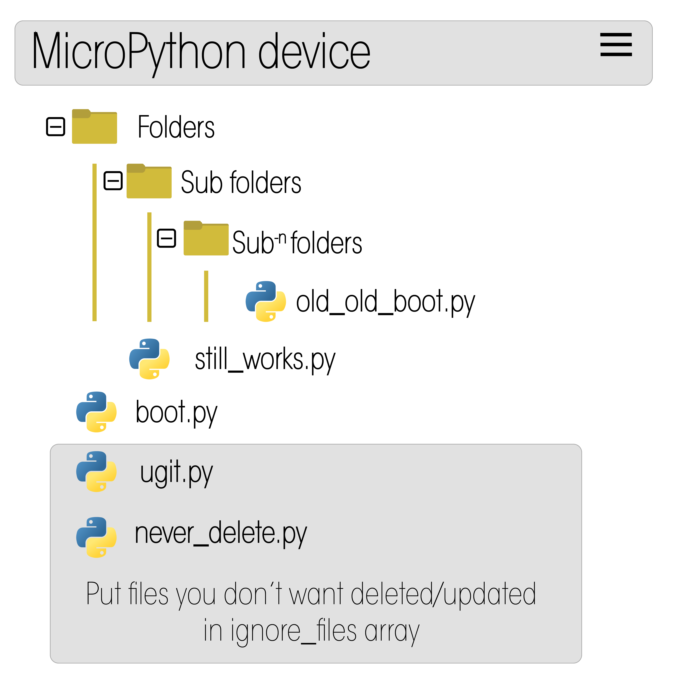

<br />
<div align="center">
    
    <h1 align="center">🐍🐙 ugit — Micropython OTA Updates</h1>
  <h3 align="center">Keep your remote ESP32 devices in sync with a GitHub repo.</h3>
  <h2 align="center">Pulls entire GitHub repository onto a MicroPython board</h2>
  <p align="center">Over The Air, with one command: <code>ugit.pull_all()</code></p>
</div>

---

> 🐙 **Upgrading from v1.x?** See the [Migration Guide](#-migrating-from-v1x) below. The v2.0 API is not backward compatible — credentials are no longer stored inside ugit.py.

---

## 🐍 About ugit

ugit syncs the entire file structure of an ESP32 (or any MicroPython board with WiFi) with a GitHub repository. Use it for OTA updates of your IoT devices in the field.

**What's new in v2.0:**
* 🐙 **Hash-based updates** — only downloads files that actually changed (GitHub-compatible SHA1)
* 🔒 **Secure config** — WiFi passwords and tokens stored in `/config.json` on the device, never in your code
* 🛡️ **Safe updates** — `safe_pull_all()` checks storage space and creates a backup before updating
* ⏪ **Rollback** — `restore()` recovers from backup if an update goes wrong
* 🔍 **Update detection** — `check_for_updates()` tells you what changed without downloading anything
* 📦 **mip installable** — `mip.install("github:turfptax/ugit")`
* 🐍 **Zero-length file support** — no more OSError: 20
* 📄 **Binary file support** — .mpy files and other non-UTF-8 files work correctly



<p align="right">(<a href="#readme-top">back to top</a>)</p>


## 📦 Installation

### Option 1: mip (recommended)

```python
import mip
mip.install("github:turfptax/ugit")
```

### Option 2: Manual

Copy `ugit.py` onto your MicroPython board using Thonny, mpremote, or ampy.


## 🚀 Quick Start

### Step 1: One-time setup (via REPL or Thonny) 🐍

Run this once on your device to save your credentials. They are stored in `/config.json` on the device and never uploaded to GitHub.

```python
import ugit

ugit.create_config(
    ssid='YourWifiName',
    password='YourWifiPassword',
    user='your-github-username',
    repository='your-repo-name',
    branch='main',
    token=''  # optional: GitHub personal access token for private repos
)
```

### Step 2: Use in your code (safe to commit to GitHub) 🐙

```python
# boot.py or main.py — no secrets in this file!
import ugit

ugit.pull_all()
```

That's it! Your device will connect to WiFi, check GitHub for changes, download only what's new, and reboot.


## 🐍 Usage Examples

### 🔍 Check for updates without downloading

```python
import ugit

ugit.wificonnect()
changes = ugit.check_for_updates(isconnected=True)
print(changes)
# {'new': ['/newfile.py'], 'changed': ['/boot.py'], 'deleted': []}

if changes['new'] or changes['changed']:
    ugit.pull_all(isconnected=True)
```

### 🛡️ Safe update with backup and storage check

```python
import ugit

# Checks free space, creates backup, then updates
# If update fails, run ugit.restore() to roll back
ugit.safe_pull_all()
```

### 🐙 Update without auto-reset

```python
import ugit

ugit.wificonnect()
log = ugit.pull_all(isconnected=True, reset_after=False)
print(log)
```

### 📡 Use your own WiFi connection

```python
import ugit
import network

wlan = network.WLAN(network.STA_IF)
wlan.active(True)
wlan.connect('SSID', 'Password')

ugit.pull_all(isconnected=True)
```

### 🚫 Ignore specific files

Files can be ignored via `create_config()` or passed directly. ugit always auto-protects `/ugit.py`, `/config.json`, `/ugit.backup`, and `/ugit_log.txt`.

```python
ugit.create_config(
    ssid='MyWifi',
    password='MyPass',
    user='turfptax',
    repository='my-project',
    ignore=['/my_local_data.json', '/calibration.py']
)
```

### 💾 Check device storage

```python
>>> ugit.storage_info()
Storage: 2048 KB total, 80 KB used, 1968 KB free (96% free)
```

### ⏪ Backup and restore

```python
# Create a backup
ugit.backup()

# Restore from backup (if an update went wrong)
ugit.restore()
```

### 🔒 View saved config (passwords masked)

```python
>>> ugit.show_config()
  ssid: MyWifi
  password: MyP***
  user: turfptax
  repository: my-project
  branch: main
  token:
  ignore: []
```

### 🐍 Update ugit itself

```python
ugit.update()
# Reset device to use new version
```


## 🐙 API Reference

| Function | Description |
|---|---|
| `create_config(ssid, password, user, repository, ...)` | 🔒 Save credentials to device (one-time setup) |
| `show_config()` | 🔍 Display config with passwords masked |
| `pull_all(...)` | 🐙 Sync device with GitHub repo (only downloads changes) |
| `safe_pull_all(...)` | 🛡️ Like pull_all but checks storage and creates backup first |
| `check_for_updates(...)` | 🔍 Preview changes without downloading |
| `wificonnect(ssid, password)` | 📡 Connect to WiFi (reads from config if no args) |
| `pull(filepath, raw_url)` | ⬇️ Download a single file |
| `backup()` | 💾 Backup all device files to /ugit.backup |
| `restore()` | ⏪ Restore files from backup |
| `storage_info()` | 💾 Show device storage usage |
| `update()` | 🐍 Update ugit.py itself from this repository |

All functions read from `/config.json` when arguments are omitted.


## 🔒 Security Notes

- **Never commit `config.json` to your GitHub repository.** It contains your WiFi password and optionally a GitHub token.
- `config.json` is automatically protected — ugit will never delete or overwrite it during sync.
- If using a private repository, create a [GitHub personal access token](https://github.com/settings/tokens) with `repo` scope and pass it as `token`.
- `show_config()` masks passwords and tokens so they aren't displayed in full.


## 🐙 Migrating from v1.x

v2.0 is a full rewrite. If you have devices running v1.x, here's what you need to know:

**What changed:**
- 🐍 Credentials are no longer stored as variables inside `ugit.py` — they go in `/config.json`
- 🐍 `pull_all()` no longer uses module-level globals — pass arguments or use `create_config()`
- 🐍 The `ignore_files` variable is gone — use the `ignore` parameter or `create_config(ignore=[...])`
- 🐙 File hashing now matches GitHub's blob format — updates are incremental instead of full re-downloads
- 📄 Files are written in binary mode — .mpy and other non-text files work correctly

**How to upgrade:**

1. 📝 Note your current settings from the top of your old `ugit.py` (ssid, password, user, repository)
2. 🐍 Replace `ugit.py` on the device with the new version
3. 🔒 Run `create_config()` once with your settings:
   ```python
   import ugit
   ugit.create_config(ssid='...', password='...', user='...', repository='...')
   ```
4. ✏️ Update your `boot.py` / `main.py` — remove any credential variables, just call `ugit.pull_all()`

**If you need the old version:** The v1.x code is available at the [`v1.0`](https://github.com/turfptax/ugit/tree/main) tag. You can pin to it, but it will not receive updates.


## 🗺️ Roadmap

See the [open issues](https://github.com/turfptax/ugit/issues) for a list of proposed features and known issues.

- [x] 🐙 SHA1 hash-based incremental updates
- [x] ⏪ Rollback / restore function
- [x] 🐍 ugit.py self-update function
- [x] 📋 Simplified logging
- [x] 🔒 Secure credential storage
- [x] 💾 Storage space checking
- [x] 🐍 Zero-length file handling
- [x] 📄 Binary file support
- [ ] 🦊 GitLab support
- [ ] 🧠 Memory optimization for large repos

## License

Distributed under the GNU GPL v3 License. See `License.md` for more information.

---

<div align="center">
  <p>🐍🐙 Made with love for the <a href="https://openmuscle.org">OpenMuscle</a> project 🐙🐍</p>
</div>
